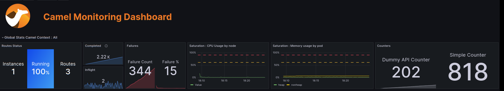
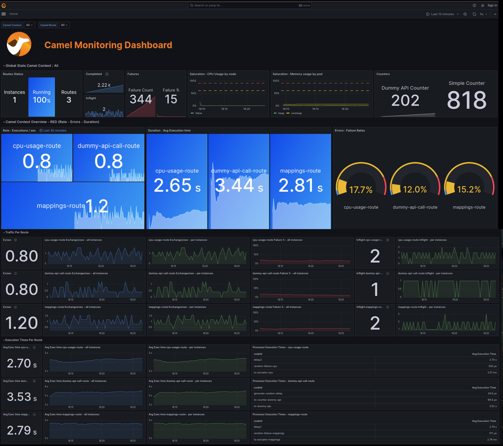
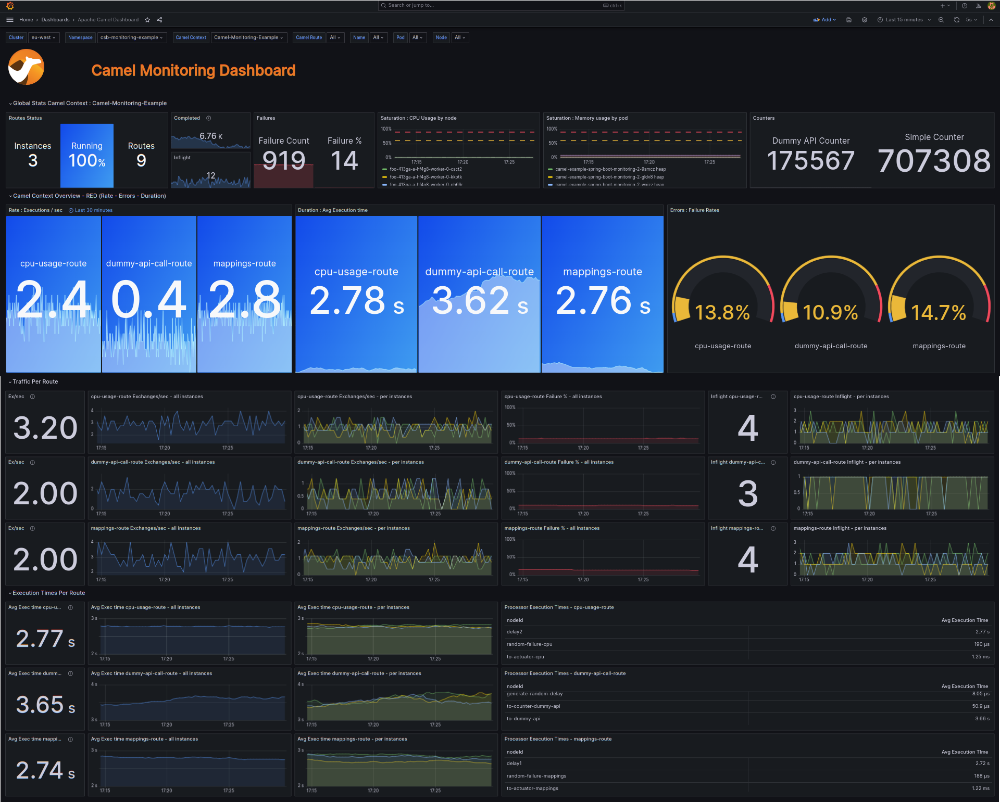

= Camel Monitoring with Actuator - Micrometer, Prometheus and Grafana example
:autofit-option:

This example shows how you can monitor Camel on Spring Boot applications using Prometheus and Grafana.

=== Adding Prometheus support

In order to add Prometheus support to our Camel Spring Boot application, we’re going to need to expose Prometheus statistics through an actuator endpoint. Here is what we do :

Edit your src/main/resources/application.properties - if you have a management.endpoints.web.exposure.include entry, add prometheus, metrics, and health. If you do not have a management.endpoints.web.exposure.include entry, please add one.

:source-highlighter: coderay
[source, properties]
----
# expose actuator endpoint via HTTP
management.endpoints.web.exposure.include=mappings,metrics,health,shutdown,jolokia,prometheus
----

Next we need to add some starter support to our pom.xml - add the following to the <dependencies/> section of your link:pom.xml[pom.xml] :

[source.small, xml]
----
        <dependency>
            <groupId>io.micrometer</groupId>
            <artifactId>micrometer-registry-prometheus</artifactId>
        </dependency>

        <dependency>
            <groupId>org.jolokia</groupId>
            <artifactId>jolokia-server-core</artifactId>
            <version>${jolokia-version}</version>
        </dependency>

        <dependency>
            <groupId>io.prometheus.jmx</groupId>
            <artifactId>collector</artifactId>
            <version>${prometheus-version}</version>
        </dependency>
----

Then we need to edit our Spring Boot Application itself so that - add the following to link:src/main/java/org/apache/camel/example/spring/boot/monitoring/Application.java[Application.java]

[source%autofit, java, %linenums, highlight=5 ]
----

    @Bean(name = {MicrometerConstants.METRICS_REGISTRY_NAME, "prometheusMeterRegistry"})
    public PrometheusMeterRegistry prometheusMeterRegistry(
            PrometheusConfig prometheusConfig, CollectorRegistry collectorRegistry, Clock clock) throws MalformedObjectNameException, IOException {

        InputStream resource = new ClassPathResource("config/prometheus_exporter_config.yml").getInputStream();

        new JmxCollector(resource).register(collectorRegistry);
        new BuildInfoCollector().register(collectorRegistry);
        return new PrometheusMeterRegistry(prometheusConfig, collectorRegistry, clock);
    }

    @Bean
    public CamelContextConfiguration camelContextConfiguration(@Autowired PrometheusMeterRegistry registry) {

        return new CamelContextConfiguration() {
            @Override
            public void beforeApplicationStart(CamelContext camelContext) {
                MicrometerRoutePolicyFactory micrometerRoutePolicyFactory = new MicrometerRoutePolicyFactory();
                micrometerRoutePolicyFactory.setMeterRegistry(registry);
                camelContext.addRoutePolicyFactory(micrometerRoutePolicyFactory);

                MicrometerMessageHistoryFactory micrometerMessageHistoryFactory = new MicrometerMessageHistoryFactory();
                micrometerMessageHistoryFactory.setMeterRegistry(registry);
                camelContext.setMessageHistoryFactory(micrometerMessageHistoryFactory);

                MicrometerExchangeEventNotifier micrometerExchangeEventNotifier =  new MicrometerExchangeEventNotifier();
                micrometerExchangeEventNotifier.setMeterRegistry(registry);
                camelContext.getManagementStrategy().addEventNotifier(micrometerExchangeEventNotifier);

                MicrometerRouteEventNotifier micrometerRouteEventNotifier = new MicrometerRouteEventNotifier();
                micrometerRouteEventNotifier.setMeterRegistry(registry);
                camelContext.getManagementStrategy().addEventNotifier(micrometerRouteEventNotifier);

            }

            @Override
            public void afterApplicationStart(CamelContext camelContext) {
            }
        };
    }
----

=== Testing the Prometheus support

In a shell run:

[source.small, console]
----
mvn spring-boot:run
----

we can test that the statistics we want are exposed. Check that the +/actuator/prometheus+ endpoint has been exposed, make sure to look at the port your application was deployed at http://localhost:8080/actuator/prometheus

[source.small]
----
# HELP tomcat_sessions_created_sessions_total
# TYPE tomcat_sessions_created_sessions_total counter
tomcat_sessions_created_sessions_total 0.0
# HELP http_server_requests_active_seconds_max
# TYPE http_server_requests_active_seconds_max gauge
http_server_requests_active_seconds_max{exception="none",method="GET",outcome="SUCCESS",status="200",uri="UNKNOWN",} 0.007406805
# HELP http_server_requests_active_seconds
# TYPE http_server_requests_active_seconds summary
http_server_requests_active_seconds_active_count{exception="none",method="GET",outcome="SUCCESS",status="200",uri="UNKNOWN",} 1.0
http_server_requests_active_seconds_duration_sum{exception="none",method="GET",outcome="SUCCESS",status="200",uri="UNKNOWN",} 0.007379139
# HELP process_start_time_seconds Start time of the process since unix epoch.
# TYPE process_start_time_seconds gauge
process_start_time_seconds 1.696867003417E9
# HELP disk_free_bytes Usable space for path
# TYPE disk_free_bytes gauge
disk_free_bytes{path="/home/ldemasi/Work/Progetti/downstream/camel-spring-boot-examples/monitoring-micrometrics-grafana-prometheus/.",} 4.8643588096E10
# HELP tomcat_sessions_active_current_sessions
# TYPE tomcat_sessions_active_current_sessions gauge
tomcat_sessions_active_current_sessions 0.0
# HELP tomcat_sessions_alive_max_seconds
# TYPE tomcat_sessions_alive_max_seconds gauge
tomcat_sessions_alive_max_seconds 0.0
# HELP jvm_threads_daemon_threads The current number of live daemon threads
# TYPE jvm_threads_daemon_threads gauge
jvm_threads_daemon_threads 36.0
# HELP dummy_call_counter_total
# TYPE dummy_call_counter_total counter
dummy_call_counter_total{camelContext="Camel-Monitoring-Example",} 2.0
......
----

=== Run locally on Docker

Is possible to run the entire project with prometheus and grafana using docker maven plugin.
In order to run it , you need to have a running docker daemon on your machine, then in a shell
you can run:

[source,console]
----
mvn clean package docker:build  docker:start docker:watch -Ddocker.watchMode=run docker:stop  -P docker
----

Go to http://localhost:3000/ and you should see this dashboard:

=== Run on Openshift

To deploy on Openshift, you have to create a project with name +csb-monitoring-example+:

[source, console]
----
oc new-project csb-monitoring-example
----

you can customize the project name setting the +jkube.namespace+ in the link:pom.xml[pom.xml] :

[source.small,xml,highlight=5,%linenums]
----
    <properties>
        <category>Management and Monitoring</category>
        ....
        <jkube.replicas>3</jkube.replicas>
        <jkube.namespace>csb-monitoring-example</jkube.namespace>
    </properties>
----

or passing it as argument on command line +-Djkube.namespace=..."

When the project  is created, is possible to deploy everything, running the following command:

[source,console]
----
mvn clean package oc:deploy -Popenshift
----

Pointing your browser to http://<OPENSHIFT_GRAFANA_BASE_URL>/d/apache-camel-dashboard/apache-camel-dashboard you should see this:

=== Help and contributions

If you hit any problem using Camel or have some feedback, then please
https://camel.apache.org/support.html[let us know].

We also love contributors, so
https://camel.apache.org/contributing.html[get involved] :-)

The Camel riders!
