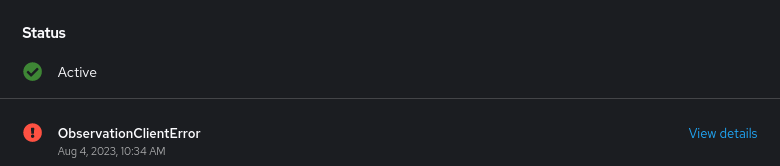

## Requirements

install oc client https://docs.openshift.com/container-platform/4.13/cli_reference/openshift_cli/getting-started-cli.html[docs]

prepare monitor stack on OCP https://access.redhat.com/documentation/en-us/openshift_container_platform/4.13/html-single/monitoring/index#configuring-the-monitoring-stack[docs]

check if user project monitoring is enabled https://access.redhat.com/documentation/en-us/openshift_container_platform/4.13/html-single/monitoring/index#enabling-monitoring-for-user-defined-projects[docs]
----
oc -n openshift-monitoring describe configmap cluster-monitoring-config | grep enableUserWorkload
----
the result should be
----
enableUserWorkload: true
----
granting users permission to configure monitoring for user-defined projects https://access.redhat.com/documentation/en-us/openshift_container_platform/4.13/html-single/monitoring/index#granting-users-permission-to-configure-monitoring-for-user-defined-projects_enabling-monitoring-for-user-defined-projects[docs]

## Deploy the application
----
oc new-project <name of the project>
----
make sure that the `Red Hat OpenShift distributed tracing platform Operator` is installed before running following command https://docs.openshift.com/container-platform/4.13/distr_tracing/distr_tracing_install/distr-tracing-installing.html#distr-tracing-jaeger-operator-install_install-distributed-tracing[docs]
----
oc apply -f ocp/jaeger.yaml
----
build the application and deploy the services in the namespace
----
mvn clean package -Popenshift
----

add targets for metrics

----
oc apply -f ocp/service-monitor.yaml
----

configuring example alert https://docs.openshift.com/container-platform/4.13/monitoring/managing-alerts.html#creating-alerting-rules-for-user-defined-projects_managing-alerts[docs]

----
oc apply -f ocp/alert-rule.yaml
----

## Observe data

### Distributed tracing using Jaeger

To see traces connect to the Jaeger UI at:
----
echo "https://$(oc get route jaeger-all-in-one-inmemory -o go-template --template='{{.spec.host}}')"
----
Select `client` as a `Service` parameter and `trigger` as `Operation` parameter.
If you want to filter only errors fill in the `Tags` parameter the value `error=true`

### Inspect collected Metrics with OCP integrated UI

To see collected metrics, connect to the console at:
----
echo "$(oc whoami --show-console)/monitoring/query-browser"
----
or navigate manually to `Observe -> Metrics` in the web console menu

you can fill the query field to show data and graph, for example:

----
#show the max execution time for the camel-http and camel-jetty components (with and without errors)

POST_seconds_max{component="camel-jetty"} or POST_seconds_max{component="camel-http"}

#how many triggered events by the camel-trigger component (with and without errors)

trigger_seconds_count{component="camel-timer"}
----

moreover the alert example is fired if an error is faced within the latest 30 seconds
----
echo "$(oc whoami --show-console)/monitoring/alerts?rowFilter-alert-source=user"
----
or navigate manually to `Observe -> Alerting` in the web console menu, filtering results by `Source=User`

Once fired the alert it is also visible in the Status panel of the project's Overview panel

